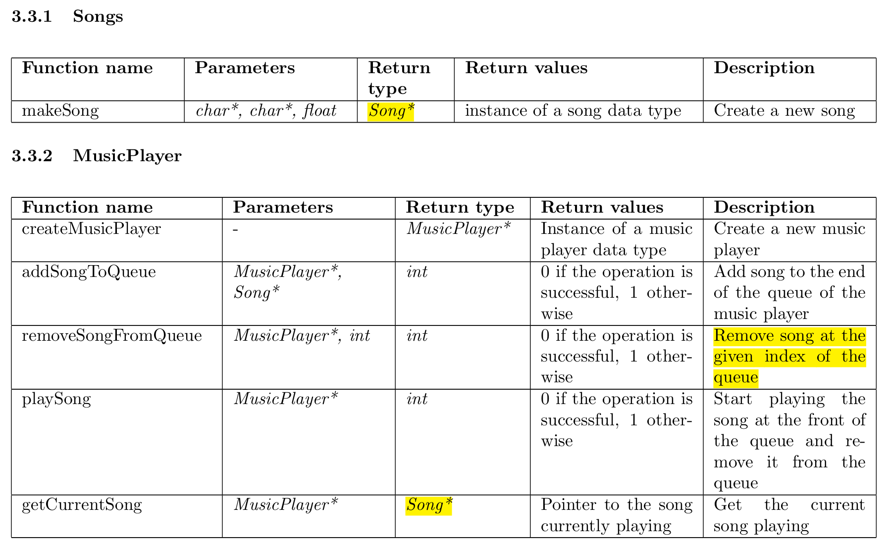

# Music Player Implemented in C

C program to learn more about Abstract Data Types by creating a music player which was made as part of my DSA assignment in my 2nd semester.

The music player is be able to add, and delete in the queue along with the ability to play them.

 

---

## Instructions to compile and run

    $ make                          # To compile the program
    $ ./musicplayer.out             # To run the program

To remove the a.out files use

    $ make clean        # To remove the a.out files

---
## File structure
The code  consists of three .c files as follows:
    
    1. song.h - Defines the ADT and the function prototypes.
    2. song.c - Implements the ADT and the functions.
    3. musicplayer.h - Defines the ADT and the function prototypes.
    4. musicplayer.c - Implements the ADT and the functions.
    5. main.c - Uses the ADT and calls the different functions implemented.

---
## Data Types

 

### Song
All the songs are stored in this with the following information:
    
    1. Name: The name of the song
    2. Artist: The name of the artist of the song
    3. Duration: Duration of the song in seconds

### MusicPlayer
The music player should have the following data present in it:

    1. Current song: The current song that is playing.
    2. Queue: Stores the queue in which the songs should be played from.

---
## Different commands for the music player

 

* ADD / make_song: Adds a song to the queue.
    * Parameters : Name, Artist, Duration

 

* INSERT / add_queue: Adds a song to the queue at the last position
    * Parameters : Name

 

* PLAY / play: Plays the current song
    * Parameters : None 
 

* REMOVE / remove_song: Removes the song from the queue from a particular position
    * Parameters : position

 

* PLAY / play_song : Plays the song from the queue shifting the current song to the next song
    * Parameters : None

 

* GET / current_song: Prints the current song
    * Parameters : None

 

---

## Function Definitions

 

 

---

## Sample Input and Output

INPUT

    add queue user1 song1
    add queue user1 song2
    add queue user1 song3
    play song user1
    play song user1

OUTPUT
    
    song2
